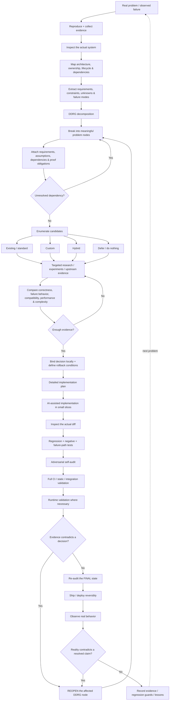

*_I temporary use this AI generated img till the artist finishes my banner. This has been allowed by the artist_

### 🟢 Catch Me Live on Discord

---

### 🎯 How I Actually Work

> **Zero trust, evidences makes senses.**

I don't trust a fix without enough evidences and can't be proved. Every real problem goes through **DDRG (Dynamic Decomposition Reasoning Graph)**. It's a decision-graph methodology I built myself. It's not an established framework, and you won't find it written up anywhere else. No trusting "the standard solution" by default, no closing a decision without evidence behind it.

<b>📐 Click to see the full workflow</b>

DDRG isn't a fixed checklist. It keeps assumptions, dependencies, candidate solutions, decisions, and the evidence behind them visible and reopens them when reality proves something wrong.

---

### 🛠️ Tech Stack

**Languages**

**Frameworks / Platforms / Tools**

**Databases**

---

### My Journey

 

---

### 🎮 Games

I always welcome who want to play with me but I don't like toxic ones.  

#### 

> **Daily mechanical gacha.**
>
> Some days I look suspiciously competent.
> Other days I appear to have forgotten how a mouse works.
>
> `Peak · Immortal 1 · 50 RR`
> `Riot ID · ItzHerzchen#ILYVM` `Shard · SEA`

 

#### 

> **Started because of someone. Still here in case they ever come back.**
>
> Mostly here for combat, build optimization, and the story.
>
> Exploration usually happens when the Primogem situation becomes sufficiently desperate.
>
> Also somehow managed an **8-loss 50/50 streak** — yes, I'm counting Capturing Radiance too.
>
> `UID · 1802761525`
> `Server · Asia`

 

#### 

> **Two completely different players depending on the queue.**
>
> **Ranked:** suddenly survival is a very serious matter.
> **Normal:** every terrible push starts looking strangely reasonable.
>
> `IGN · ItzHerzchen` `Clan · TLCG`

 

#### 

> **Pure support player.**
>
> I mostly play dedicated buff / support heroes.
>
> If I've decided you're the one I'm protecting, there's a decent chance the entire team dies before you do.
>
> `IGN · 龍•Hεrƶϲћεηッ`

 

#### 

> **Beautiful world. Excellent combat. Apparently that was enough.**
>
> I came for the visuals and stayed because the combat actually feels good.
>
> `UID · 908083609`
> `Server · SEA`

---

### 🎭 Outside the Editor

#### ✨ Cosplay

Mostly **female characters** from **Genshin Impact, Zenless Zone Zero, Wuthering Waves**, and whatever else manages to catch my attention.

I prefer **source-accurate cosplay**.

I'm happy to see how close I can get to the original character. Not just the outfit, but the overall impression.

The other part is getting to step into a completely different version of myself for a while.

Considering people can already get wildly different impressions of me depending on when and how they know me, that part feels strangely appropriate.

 

#### 🐈 Other Rabbit Holes

#### 🎵 Music

Fast rhythmic tracks, remixes, electronic stuff, or something completely different when the mood changes.

---

### 🔗 Connect With Me

  &nbsp;&nbsp;
  &nbsp;&nbsp;
  &nbsp;&nbsp;
  &nbsp;&nbsp;
  &nbsp;&nbsp;
  

💛 Feeling generous?
<a href="https://www.paypal.com/paypalme/itzherzchen">Support me and my work on PayPal</a>

---

💬 For questions, collaboration, gaming, or work, feel free to reach out to me on Discord.

🎨 Special thanks to `_napirilles` for drawing my mascot!

